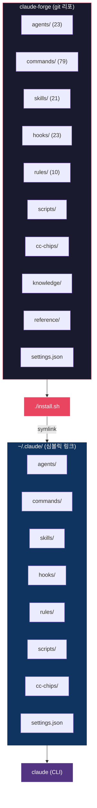
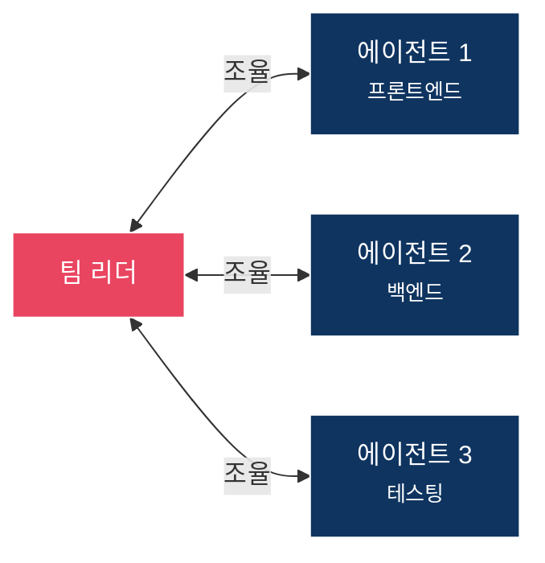

<picture>
  <source media="(prefers-color-scheme: dark)" srcset="docs/banner.png">
  <source media="(prefers-color-scheme: light)" srcset="docs/banner-light.png">
  
</picture>

<p align="center">
  <strong>Claude Code를 위한 프로덕션 수준 설정 프레임워크</strong>
</p>

<p align="center">
  <a href="LICENSE"></a>
  <a href="https://claude.com/claude-code"></a>
  <a href="https://github.com/sangrokjung/claude-forge/stargazers"></a>
</p>

<p align="center">
  <a href="#-빠른-시작">빠른 시작</a> &bull;
  <a href="#-구성-요소">구성 요소</a> &bull;
  <a href="#-아키텍처">아키텍처</a> &bull;
  <a href="#-핵심-기능">핵심 기능</a> &bull;
  <a href="#-커스터마이징">커스터마이징</a> &bull;
  <a href="README.md">English</a>
</p>

---

## Claude Forge란?

Claude Forge는 **Claude Code**를 기본 CLI에서 **완전한 개발 환경**으로 변환합니다. 설치 한 번으로 23개 전문 에이전트, 79개 슬래시 커맨드, 21개 스킬 워크플로우, 23개 보안 훅, 10개 규칙 파일이 모두 연결됩니다.

> oh-my-zsh가 터미널을 강화하듯, Claude Forge는 AI 코딩 어시스턴트를 **파워 유저 도구**로 업그레이드합니다.

---

## ⚡ 빠른 시작

```bash
# 1. 클론
git clone --recurse-submodules https://github.com/sangrokjung/claude-forge.git
cd claude-forge

# 2. 설치 (~/.claude에 심볼릭 링크 생성)
./install.sh

# 3. Claude Code 실행
claude
```

이것으로 끝. 모든 에이전트, 커맨드, 훅, 규칙이 즉시 사용 가능합니다.

---

## 📦 구성 요소

<p align="center">
  
</p>

| 카테고리 | 수량 | 주요 항목 |
|:--------:|:----:|:----------|
| **에이전트** | 23 | `planner` `architect` `code-reviewer` `security-reviewer` `tdd-guide` `database-reviewer` `web-designer` `codex-reviewer` `gemini-reviewer` ... |
| **커맨드** | 79 | `/commit-push-pr` `/handoff-verify` `/explore` `/tdd` `/plan` `/orchestrate` `/generate-image` ... |
| **스킬** | 21 | `build-system` `security-pipeline` `eval-harness` `team-orchestrator` `session-wrap` ... |
| **훅** | 23 | 7단계 보안 방어, 크로스 모델 자동 리뷰, MCP 속도 제한, 시크릿 필터링 |
| **규칙** | 10 | `coding-style` `security` `git-workflow` `golden-principles` `agent-orchestration` ... |
| **MCP 서버** | 6 | `context7` `memory` `exa` `github` `fetch` `jina-reader` |

---

## 🏗 아키텍처



설치 스크립트가 리포에서 `~/.claude/`로 **심볼릭 링크**를 생성하므로, `git pull` 한 번으로 즉시 업데이트됩니다.

<details>
<summary><strong>전체 디렉토리 구조</strong></summary>

```
claude-forge/
  ├── .claude-plugin/       플러그인 매니페스트
  ├── .github/workflows/    CI 검증
  ├── agents/               에이전트 정의 (.md)
  ├── cc-chips/             상태바 서브모듈
  ├── cc-chips-custom/      커스텀 상태바 오버레이
  ├── commands/             슬래시 커맨드 (.md + 디렉토리)
  ├── docs/                 스크린샷, 다이어그램
  ├── hooks/                이벤트 기반 스크립트
  ├── knowledge/            지식 베이스
  ├── reference/            참조 문서
  ├── rules/                자동 로드 규칙 파일
  ├── scripts/              유틸리티 스크립트
  ├── setup/                설치 가이드 + 템플릿
  ├── skills/               다단계 스킬 워크플로우
  ├── install.sh            macOS/Linux 설치 스크립트
  ├── install.ps1           Windows 설치 스크립트
  ├── mcp-servers.json      MCP 서버 설정
  ├── settings.json         Claude Code 설정
  ├── CONTRIBUTING.md       기여 가이드
  ├── SECURITY.md           보안 정책
  └── LICENSE               MIT 라이선스
```

</details>

---

## 🔑 핵심 기능

### 크로스 모델 리뷰 파이프라인

<p align="center">
  
</p>

파일 수정 시 PostToolUse 훅을 통해 **3개 AI 리뷰어가 자동 실행**됩니다:

| 리뷰어 | 엔진 | 초점 |
|:-------|:-----|:-----|
| **Code Reviewer** | Claude (네이티브) | 종합 품질, 패턴, 버그 |
| **Codex Reviewer** | OpenAI Codex | 세컨드 오피니언, 대안 제시 |
| **Gemini Reviewer** | Google Gemini 3 Pro | 프론트엔드, UI/UX 패턴 |

세 가지 관점, 수동 설정 제로. 의견 불일치가 진짜 문제를 드러냅니다.

---

### 7단계 보안 방어

<p align="center">
  
</p>

모든 작업이 계층형 보안 훅을 통과합니다:

| 단계 | 훅 | 방어 대상 |
|:----:|:---|:----------|
| 1 | `output-secret-filter.sh` | 출력에 노출된 API 키, 토큰 |
| 2 | `remote-command-guard.sh` | 안전하지 않은 원격 명령 |
| 3 | `db-guard.sh` | 파괴적 SQL (DROP, TRUNCATE) |
| 4 | `email-guard.sh` | 무단 이메일 발송 |
| 5 | `ads-guard.sh` | 의도하지 않은 광고 플랫폼 변경 |
| 6 | `calendar-guard.sh` | 무단 캘린더 수정 |
| 7 | `security-auto-trigger.sh` | 코드 변경 시 취약점 |

---

### Agent Teams

복잡한 작업을 위한 멀티 에이전트 협업:



- **Hub-and-spoke** 통신 (리더가 조율)
- **파일 소유권** 분리 (머지 충돌 없음)
- **페이즈 기반** 팀 교체
- 결정 사항은 `decisions.md`로 외부화

---

### CC CHIPS 상태바

모델, 세션 ID, 토큰 사용량, MCP 통계를 실시간으로 표시합니다.
[CC CHIPS](https://github.com/roger-me/CC-CHIPS) 기반 + 커스텀 오버레이.

---

## 🔌 MCP 서버

`mcp-servers.json`에 사전 구성 -- `./install.sh` 또는 `claude mcp add`로 설치:

| 서버 | 용도 |
|:-----|:-----|
| **context7** | 실시간 라이브러리 문서 조회 |
| **memory** | 영속적 지식 그래프 |
| **exa** | AI 기반 웹 검색 |
| **github** | 리포/PR/이슈 관리 |
| **fetch** | 웹 콘텐츠 가져오기 |
| **jina-reader** | URL→마크다운 변환 |

---

## 🎨 커스터마이징

추적되는 파일을 수정하지 않고 설정을 오버라이드할 수 있습니다:

```bash
# 로컬 오버라이드 파일 생성 (git-ignored)
cp setup/settings.local.template.json ~/.claude/settings.local.json

# 시크릿/환경설정 편집
vim ~/.claude/settings.local.json
```

`settings.local.json`은 Claude Code가 `settings.json` 위에 병합합니다.

<details>
<summary><strong>에이전트 추가하기</strong></summary>

`agents/` 디렉토리에 마크다운 파일을 생성하세요:

```markdown
# my-agent.md

에이전트의 역할, 사용 가능한 도구, 행동 규칙을 기술합니다.
```

즉시 Task 서브에이전트 타입으로 사용 가능합니다.

</details>

<details>
<summary><strong>슬래시 커맨드 추가하기</strong></summary>

`commands/` 디렉토리에 마크다운 파일을 생성하세요:

```markdown
# my-command.md

/my-command 실행 시 수행할 작업을 기술합니다.
```

</details>

<details>
<summary><strong>보안 훅 추가하기</strong></summary>

`hooks/` 디렉토리에 쉘 스크립트를 생성하고 `settings.json`에 등록하세요:

```bash
#!/bin/bash
# hooks/my-guard.sh
# 특정 도구 이벤트(PreToolUse, PostToolUse 등)에서 실행됩니다.
```

</details>

---

## 🤝 기여

에이전트, 커맨드, 스킬, 훅 추가 방법은 [CONTRIBUTING.md](CONTRIBUTING.md)를 참조하세요.

---

## 📄 라이선스

[MIT](LICENSE) -- 자유롭게 사용, 포크, 확장하세요.
