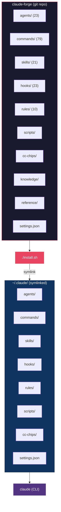
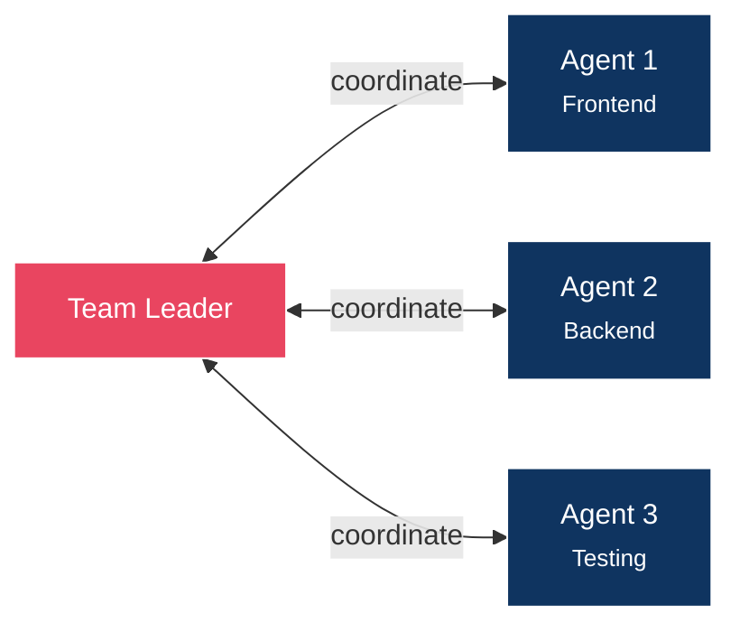

<picture>
  <source media="(prefers-color-scheme: dark)" srcset="docs/banner.png">
  <source media="(prefers-color-scheme: light)" srcset="docs/banner-light.png">
  
</picture>

<p align="center">
  <strong>Production-grade configuration framework for Claude Code</strong>
</p>

<p align="center">
  <a href="LICENSE"></a>
  <a href="https://claude.com/claude-code"></a>
  <a href="https://github.com/sangrokjung/claude-forge/stargazers"></a>
</p>

<p align="center">
  <a href="#-quick-start">Quick Start</a> &bull;
  <a href="#-whats-inside">What's Inside</a> &bull;
  <a href="#-architecture">Architecture</a> &bull;
  <a href="#-key-features">Key Features</a> &bull;
  <a href="#-customization">Customization</a> &bull;
  <a href="README.ko.md">한국어</a>
</p>

---

## What is Claude Forge?

Claude Forge transforms **Claude Code** from a basic CLI into a **full-featured development environment**. One install gives you 23 specialized agents, 79 slash commands, 21 skill workflows, 23 security hooks, and 10 rule files -- all pre-wired and ready to go.

> Think of it as a **power-user starter kit** for Claude Code: the same way oh-my-zsh enhances your terminal, Claude Forge supercharges your AI coding assistant.

---

## ⚡ Quick Start

```bash
# 1. Clone
git clone --recurse-submodules https://github.com/sangrokjung/claude-forge.git
cd claude-forge

# 2. Install (creates symlinks to ~/.claude)
./install.sh

# 3. Launch Claude Code
claude
```

That's it. All agents, commands, hooks, and rules are instantly available.

---

## 📦 What's Inside

<p align="center">
  
</p>

| Category | Count | Highlights |
|:--------:|:-----:|:-----------|
| **Agents** | 23 | `planner` `architect` `code-reviewer` `security-reviewer` `tdd-guide` `database-reviewer` `web-designer` `codex-reviewer` `gemini-reviewer` ... |
| **Commands** | 79 | `/commit-push-pr` `/handoff-verify` `/explore` `/tdd` `/plan` `/orchestrate` `/generate-image` ... |
| **Skills** | 21 | `build-system` `security-pipeline` `eval-harness` `team-orchestrator` `session-wrap` ... |
| **Hooks** | 23 | 7-layer security defense, cross-model auto-review, MCP rate limiting, secret filtering |
| **Rules** | 10 | `coding-style` `security` `git-workflow` `golden-principles` `agent-orchestration` ... |
| **MCP Servers** | 6 | `context7` `memory` `exa` `github` `fetch` `jina-reader` |

---

## 🏗 Architecture



The installer creates **symlinks** from the repo to `~/.claude/`, so updates are instant via `git pull`.

<details>
<summary><strong>Full Directory Tree</strong></summary>

```
claude-forge/
  ├── .claude-plugin/       Plugin manifest
  ├── .github/workflows/    CI validation
  ├── agents/               Agent definitions (.md)
  ├── cc-chips/             Status bar submodule
  ├── cc-chips-custom/      Custom status bar overlay
  ├── commands/             Slash commands (.md + directories)
  ├── docs/                 Screenshots, diagrams
  ├── hooks/                Event-driven shell scripts
  ├── knowledge/            Knowledge base entries
  ├── reference/            Reference documentation
  ├── rules/                Auto-loaded rule files
  ├── scripts/              Utility scripts
  ├── setup/                Installation guides + templates
  ├── skills/               Multi-step skill workflows
  ├── install.sh            macOS/Linux installer
  ├── install.ps1           Windows installer
  ├── mcp-servers.json      MCP server configurations
  ├── settings.json         Claude Code settings
  ├── CONTRIBUTING.md       Contribution guide
  ├── SECURITY.md           Security policy
  └── LICENSE               MIT License
```

</details>

---

## 🔑 Key Features

### Cross-Model Review Pipeline

<p align="center">
  
</p>

Every file edit triggers **three independent AI reviewers** via PostToolUse hooks:

| Reviewer | Engine | Focus |
|:---------|:-------|:------|
| **Code Reviewer** | Claude (native) | Comprehensive quality, patterns, bugs |
| **Codex Reviewer** | OpenAI Codex | Second opinion, alternative approaches |
| **Gemini Reviewer** | Google Gemini 3 Pro | Frontend-focused, UI/UX patterns |

Three perspectives, zero manual setup. Disagreements surface real issues.

---

### 7-Layer Security Defense

<p align="center">
  
</p>

Every action passes through layered security hooks:

| Layer | Hook | Protects Against |
|:-----:|:-----|:-----------------|
| 1 | `output-secret-filter.sh` | Leaked API keys, tokens in output |
| 2 | `remote-command-guard.sh` | Unsafe remote commands |
| 3 | `db-guard.sh` | Destructive SQL (DROP, TRUNCATE) |
| 4 | `email-guard.sh` | Unauthorized email sending |
| 5 | `ads-guard.sh` | Unintended ad platform changes |
| 6 | `calendar-guard.sh` | Unauthorized calendar modifications |
| 7 | `security-auto-trigger.sh` | Vulnerabilities in code changes |

---

### Agent Teams

Multi-agent collaboration for complex tasks:



- **Hub-and-spoke** communication (leader coordinates)
- **File ownership** separation (no merge conflicts)
- **Phase-based** team rotation
- Decisions externalized to `decisions.md`

---

### CC CHIPS Status Bar

Real-time status line showing model, session ID, token usage, and MCP stats.
Powered by [CC CHIPS](https://github.com/roger-me/CC-CHIPS) with custom overlay.

---

## 🔌 MCP Servers

Pre-configured in `mcp-servers.json` -- install via `./install.sh` or `claude mcp add`:

| Server | Purpose |
|:-------|:--------|
| **context7** | Real-time library documentation |
| **memory** | Persistent knowledge graph |
| **exa** | AI-powered web search |
| **github** | Repository / PR / issue management |
| **fetch** | Web content fetching |
| **jina-reader** | URL-to-markdown conversion |

---

## 🎨 Customization

Override any setting without modifying tracked files:

```bash
# Create your local overrides (git-ignored)
cp setup/settings.local.template.json ~/.claude/settings.local.json

# Edit with your secrets/preferences
vim ~/.claude/settings.local.json
```

`settings.local.json` is merged on top of `settings.json` by Claude Code.

<details>
<summary><strong>Adding Your Own Agents</strong></summary>

Create a markdown file in `agents/`:

```markdown
# my-agent.md

Your agent instructions here.
Describe the agent's role, available tools, and behavioral rules.
```

The agent becomes available immediately as a Task subagent type.

</details>

<details>
<summary><strong>Adding Slash Commands</strong></summary>

Create a markdown file in `commands/`:

```markdown
# my-command.md

Instructions for what the command should do when invoked with /my-command.
```

</details>

<details>
<summary><strong>Adding Security Hooks</strong></summary>

Create a shell script in `hooks/` and register it in `settings.json`:

```bash
#!/bin/bash
# hooks/my-guard.sh
# Runs on specific tool events (PreToolUse, PostToolUse, etc.)
```

</details>

---

## 🤝 Contributing

See [CONTRIBUTING.md](CONTRIBUTING.md) for guidelines on adding agents, commands, skills, and hooks.

---

## 📄 License

[MIT](LICENSE) -- use it, fork it, build on it.
